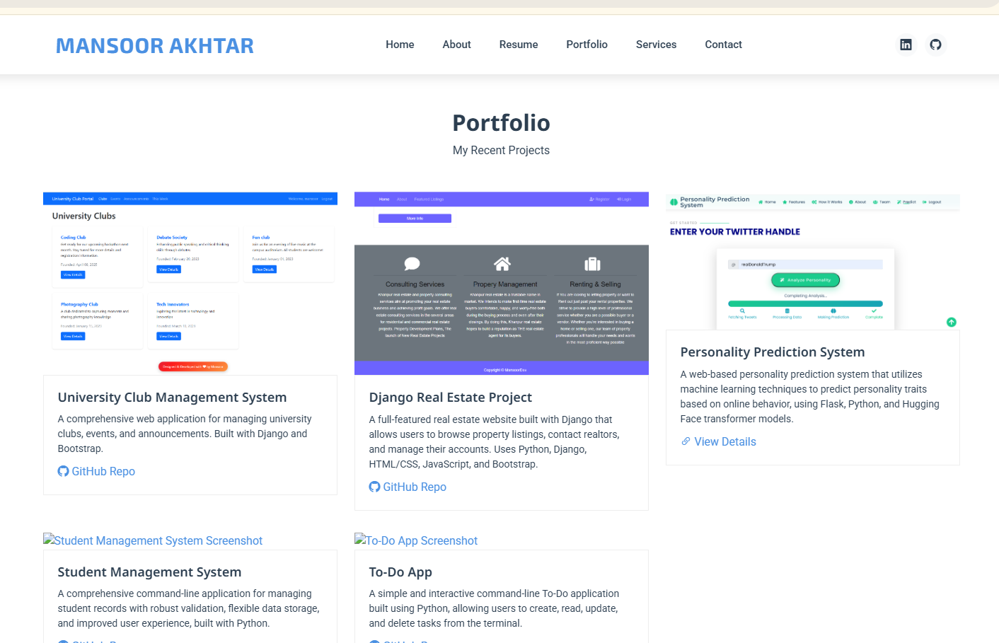

# Mansoor Akhtar - Professional Portfolio



A modern, responsive portfolio website showcasing my professional journey, skills, and projects. Built with cutting-edge web technologies and best practices.

## 🌟 Features

- **Responsive Design**: Seamless experience across all devices and screen sizes
- **Modern UI/UX**: Clean, intuitive interface with smooth animations
- **Interactive Elements**: Dynamic content presentation with AOS animations
- **Portfolio Showcase**: Elegant project display with GLightbox integration
- **Contact Form**: Easy-to-use contact interface
- **Social Integration**: Direct links to professional social media profiles
- **Performance Optimized**: Fast loading times and smooth scrolling

## 🛠️ Technologies Used

- **HTML5**: Modern markup language for structuring web content with semantic elements and enhanced features
- **CSS3**: Advanced styling with custom properties, flexbox, and grid layouts for responsive design
- **JavaScript (ES6+)**: Modern JavaScript with arrow functions, destructuring, and async/await for dynamic interactions
- **Bootstrap 5.3.3**: Powerful CSS framework for rapid responsive development and pre-built components
- **AOS (Animate On Scroll)**: Library for adding smooth scroll-triggered animations to elements
- **GLightbox**: Lightweight and customizable lightbox library for displaying images and videos
- **Pure Counter**: JavaScript library for creating animated counters with smooth transitions
- **Bootstrap Icons**: Comprehensive icon library that matches Bootstrap's design system

## 📁 Project Structure

```
portfolio/
├── index.html              # Main HTML file
├── assets/
│   ├── css/
│   │   └── main.css        # Custom styles and variables
│   ├── js/
│   │   └── main.js         # Custom JavaScript functionality
│   ├── img/               # Images and media assets
│   └── vendor/            # Third-party libraries
└── README.md              # Project documentation
```

## 🚀 Getting Started

### Prerequisites

- Modern web browser
- Basic understanding of HTML/CSS/JavaScript (for customization)

### Installation

1. Clone the repository:
   ```bash
   git clone https://github.com/yourusername/portfolio.git
   ```

2. Navigate to the project directory:
   ```bash
   cd portfolio
   ```

3. Open `index.html` in your preferred browser

## 🎨 Customization

### Theme Colors

Modify the color scheme in `assets/css/main.css`:

```css
:root {
  --primary-color: #0ea2bd;
  --secondary-color: #2c3e50;
  --text-color: #333;
  --light-color: #f8f9fa;
  --dark-color: #343a40;
}
```

### Adding Projects

Add new projects in the portfolio section:

```html
<div class="portfolio-item">
  
  <div class="portfolio-info">
    <h4>Project Title</h4>
    <p>Project Description</p>
    <a href="project-link" class="details-link">View Details</a>
  </div>
</div>
```

### Contact Information

Update contact details in the contact section:

```html
<div class="info-item">
  <i class="bi bi-envelope"></i>
  <div>
    <h4>Email:</h4>
    <p>your.email@example.com</p>
  </div>
</div>
```

## 🌐 Browser Support

- Chrome (latest)
- Firefox (latest)
- Safari (latest)
- Edge (latest)
- Opera (latest)

## 📝 License

This project is licensed under the MIT License - see the [LICENSE](LICENSE) file for details.

## 👨‍💻 Author

**Mansoor Akhtar**
- Computer Science Graduate
- Software Developer at Torch Solutions
- [LinkedIn](https://www.linkedin.com/in/mansoor-akhtar-15b075213/)
- [GitHub](https://github.com/httpsMansoor)

## 🤝 Contributing

Contributions, issues, and feature requests are welcome! Feel free to check the [issues page](https://github.com/httpsMansoor/portfolio/issues).

## 📞 Contact

For any queries or suggestions, please reach out:
- Email: mansoorkhanabbaxi@gmail.com
- LinkedIn: [https://www.linkedin.com/in/mansoor-akhtar-15b075213/]